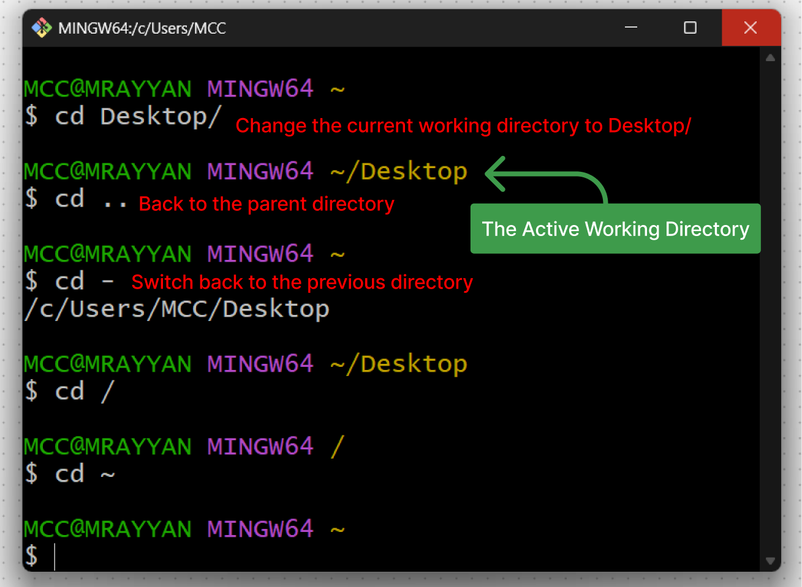

## `cd` - Change Directory

The `cd` command is used to change the current working directory.

**Syntax**: `cd [directory_path]`

**Options**:

- `cd` (without arguments): Changes to the user's home directory.
- `cd ..`: Moves to the parent directory.
- `cd -`: Switches back to the previous directory.
- `cd ~`: Changes to the user's home directory. Equivalent to `cd /c/Users/username` in Windows.
- `cd /`: Changes to the root directory.

---

## `ls` - List Directory Contents

The `ls` command lists the contents of a directory.

**Syntax**: `ls [options] [directory_path]`

**Options**:

- `-l`: Displays detailed information (long listing format).
- `-a`: Shows hidden files (those starting with a dot `.`).
- `-h`: Human-readable file sizes (e.g., KB, MB).
- `-R`: Recursively lists subdirectories.

---

## `pwd` - Print Working Directory

The `pwd` command displays the absolute path of the current working directory.

**Syntax**: `pwd`

---

## `mkdir` - Create a Directory

The `mkdir` command creates a new directory.

**Syntax**: `mkdir [options] [directory_name]`

**Options**:

- `-p`: Creates parent directories as needed.

---

## `touch` - Create a File

The `touch` command creates an empty file or updates the timestamp of an existing file.

**Syntax**: `touch [file_name]`

---

## `rm` - Remove a File

The `rm` command deletes a file or multiple files.

**Syntax**: `rm [options] [file_name]`

**Options**:

- `-r`: Recursively remove directories and their contents.
- `-f`: Forcefully remove files without prompting for confirmation.

---

## `rmdir` - Remove a Directory

The `rmdir` command removes an empty directory. it's like `rm -r` but only for empty directories.

**Syntax**: `rmdir [directory_name]`

---

## `cp` - Copy a File

The `cp` command copies files or directories.

**Syntax**: `cp [options] source destination`

**Options**:

- `-r`: Recursively copy directories.
- `-i`: Prompt before overwriting existing files.

---

## `mv` - Move or Rename a File/Directory

The `mv` command moves or renames files and directories.

**Syntax**: `mv [options] source destination`

If the destination is a new file name, the source file is renamed.

If the destination is an existing directory, the source file is moved to that directory.

---

## `cat` - Concatenate and Display File Content

The `cat` command displays the contents of a file, concatenates files, or creates new files.

**Syntax**: `cat [options] [file_name]`

**Options**:

- `-n`: Number all output lines.

---

## `clear` - Clear the Terminal Screen

The `clear` command clears the terminal screen of all previous commands and output.

**Syntax**: `clear`

---
