# Installation Guide on Linux (Ubuntu/Debian)

1. Open the terminal by pressing `Ctrl + Alt + T` or by searching for it in the applications menu.
2. Update the package list by running the following command: `sudo apt update`
3. Install Git by running the following command: `sudo apt install git`
4. Verify the installation by running the following command: `git --version`

# Installation Guide on macOS

1. Open the terminal by pressing `Command + Space` and typing `Terminal`.
2. Install Homebrew by running the following command: `/bin/bash -c "$(curl -fsSL https://raw.githubusercontent.com/Homebrew/install/HEAD/install.sh)"`
3. Install Git by running the following command: `brew install git`
4. Verify the installation by running the following command: `git --version`

# Installation Guide on Windows

If you have `winget` installed on your Windows machine, you can install Git using the following command: `winget install -e --id Git.Git`.

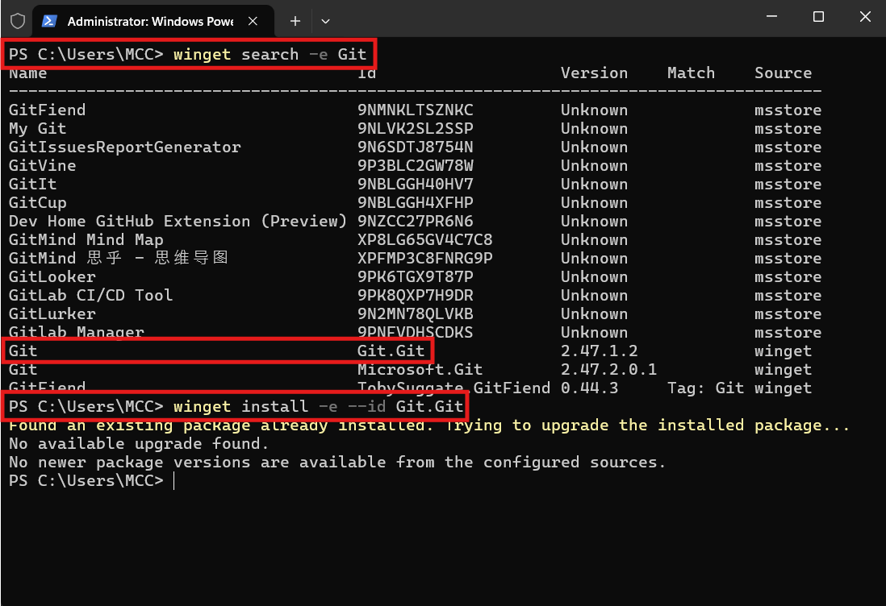

1. Navigate to the [https://git-scm.com/](https://git-scm.com/).
2. Click on the download button.

   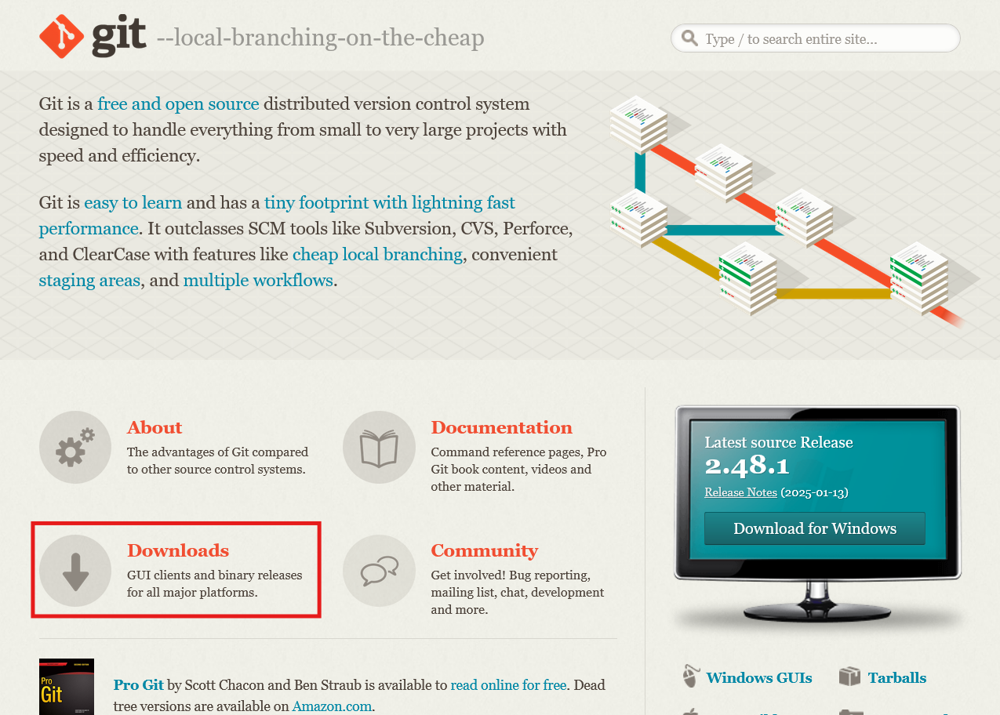

3. Chose the operating system you are using.

   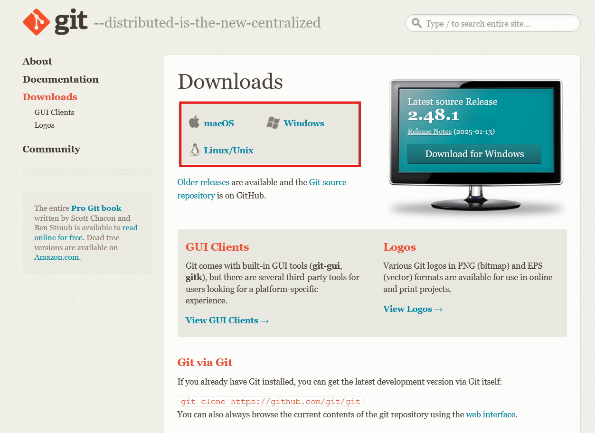

4. Click on `Click here to download` the latest version.

   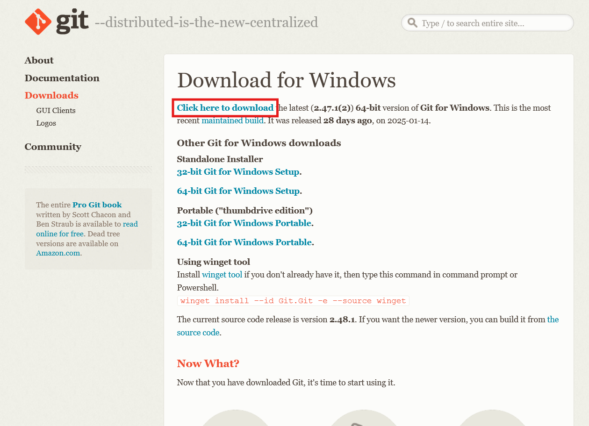

5. Double click on the downloaded file.

   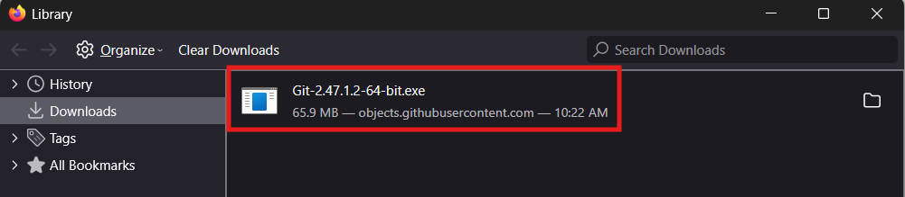

6. Click on `Next`.

   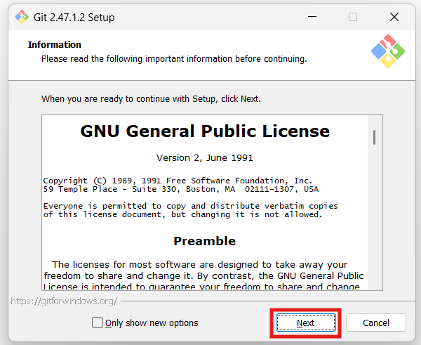

7. In the component selection screen, leave the defaults unless you need to change them and click `Next`.

   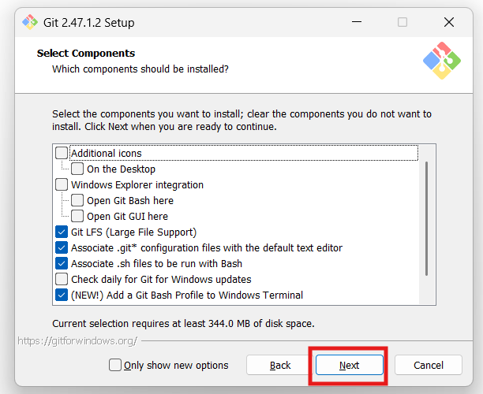

8. Select a text editor you want to use with Git. Use the drop-down menu to select Notepad++ (or whichever text editor you prefer) and click `Next`.

   Note: If you prefer to use a CLI text editor in Git Bash, select nano or Vim from the list.

   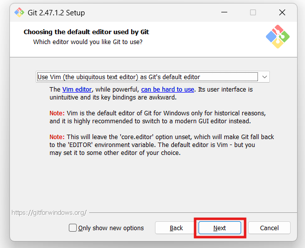

9. The next step allows you to choose a different name for your initial branch. The default is `master`. Unless you are working in a team that requires a different name, leave the default option and click `Next`.

   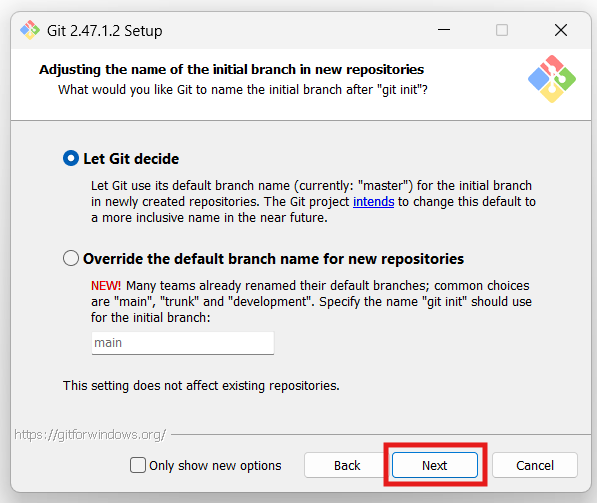

   Recommendation: If you are working on GitHub, you may want to change the default branch name to `main`.

10. The next step allows you to change the PATH environment. The PATH is the default set of directories included when you run a command from the command line. Keep the middle (recommended) selection and click `Next`.

    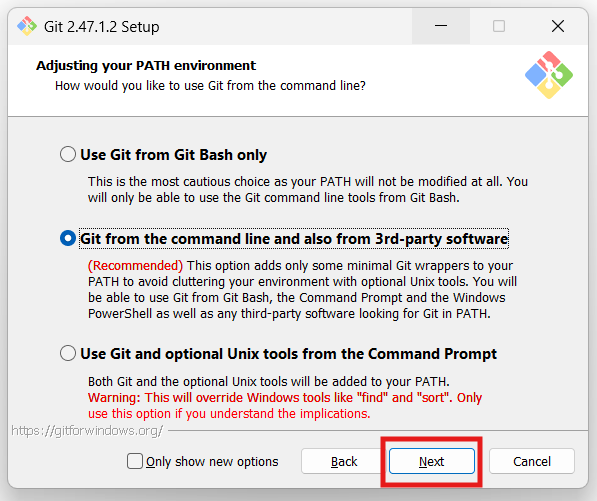

11. The installer prompts you to select the SSH client for Git to use. Git already comes with its own SSH client, so if you don't need a specific one, leave the default option and click `Next`.

    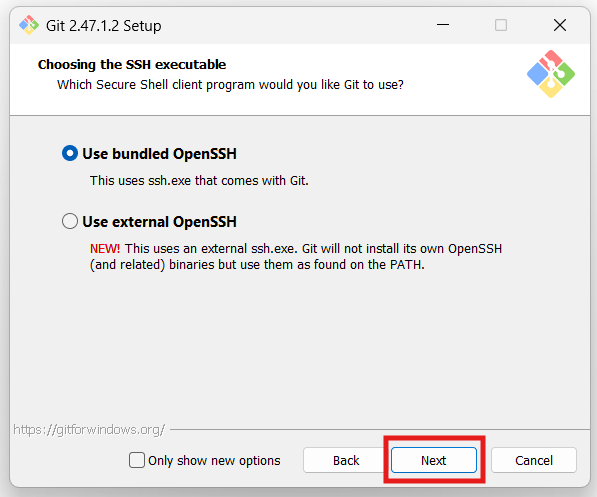

12. The next option relates to server certificates. The default option is recommended for most users. If you work in an Active Directory environment, you may need to switch to Windows Store certificates. Select your preferred option and click `Next`.

    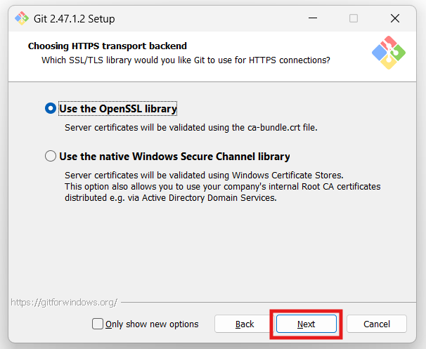

13. The following selection configures line-ending conversion, which relates to the way data is formatted. The default selection is recommended for Windows. Click `Next` to proceed.

    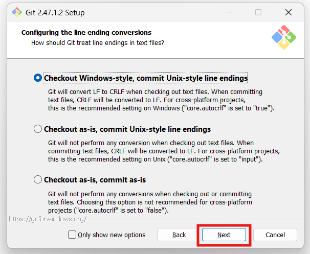

14. Choose the terminal emulator you want to use. The default MinTTY is recommended for its features. Click `Next` to continue.

    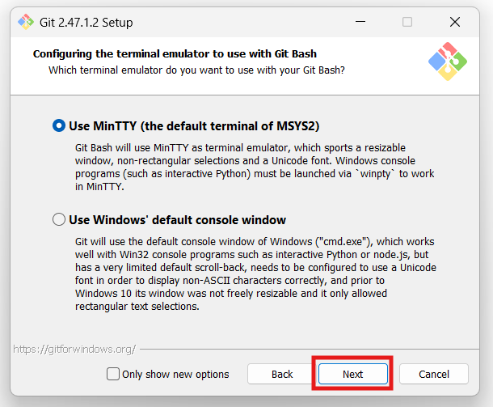

15. The next step allows you to choose what the `git pull` command will do. The default option is recommended unless you specifically need to change its behavior. Click `Next` to continue with the installation.

    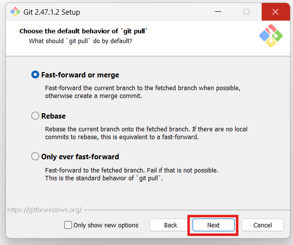

16. The next step is to choose which credential helper to use. Git uses credential helpers to fetch or save credentials. The default option is the most stable one. Select your preferred credential manager and click `Next`.

    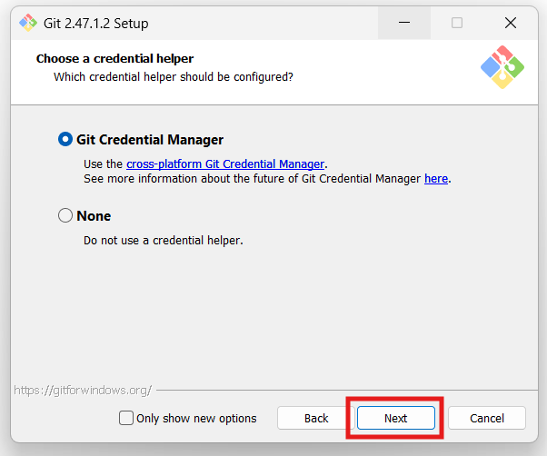

17. The next step lets you decide which extra options to enable. If you use symbolic links, which represent shortcuts for the command line, tick the box. Keep file system caching checked and click `Install`.

    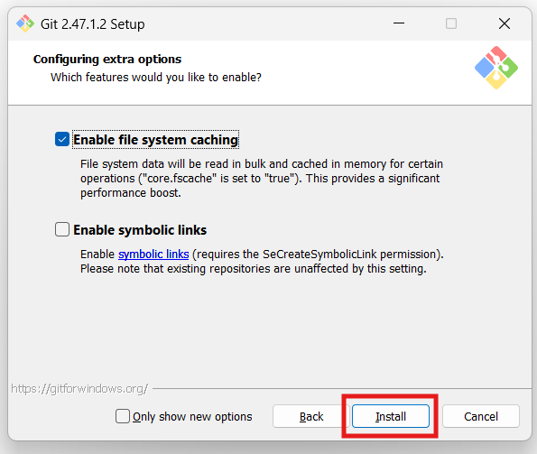

# Launch Git Bash and Verify Installation

1. Open the Start menu, type `Git Bash`, and click on the Git Bash icon to launch the application.

   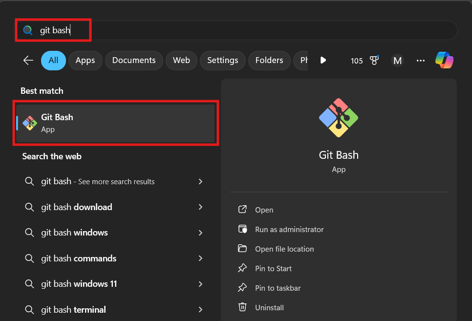

2. Type `git --version` and press `Enter` to verify that Git is installed correctly.

   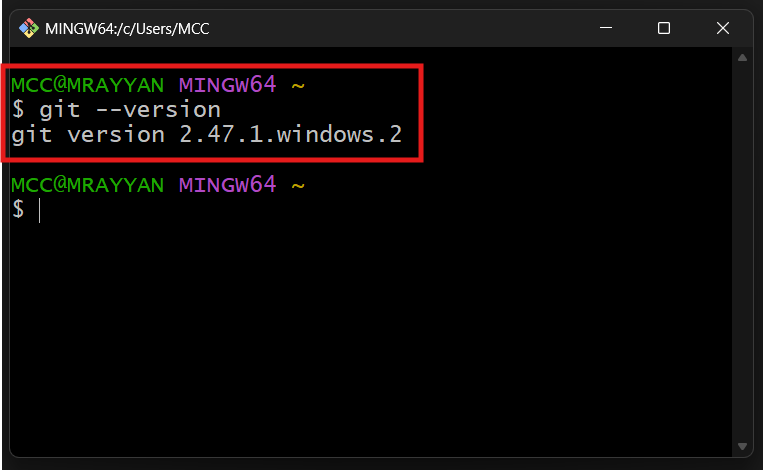

# Git Configuration

After installing Git, you need to configure it with your name and email address. This information will be used to identify you as the author of the code changes you make.

**There are three levels of configuration in Git**

1. System-Level: Applies to all users on the system. (`--system`)
2. Global-Level: Applies to the current user. (`--global`)
3. Local-Level: Applies to the current repository. (`--local`)

**Setting Up the main configuration**

- `git config --global user.name <Your-Full-Name>` -> set your name
- `git config --global user.email <Your-Email>` -> set your email
- `git config --global init.defaultBranch <name>` -> set the default branch name (the most common is `main`)
- `git config --list` -> list all configurations
- `git config --global core.editor "code --wait"` -> set Visual Studio Code as the default editor
- `git config --global --edit` -> open the global configuration file in the default editor

To update previously set configurations, you can use the same commands with the new values.

To remove a configuration, you can use the following command:

- `git config --global --unset <key>` -> remove a specific configuration
