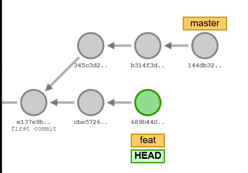
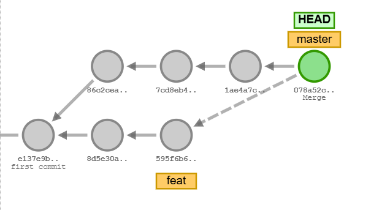
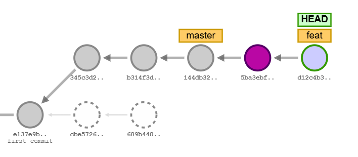
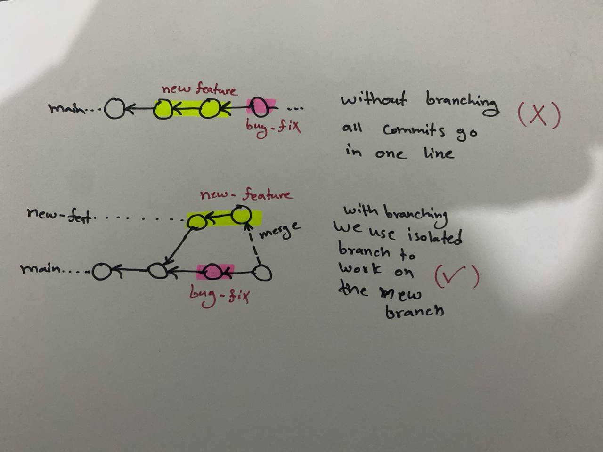
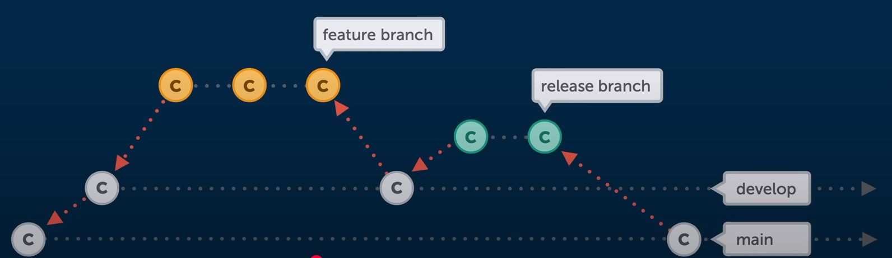

# Git Branching

## Definition

Branches in Git are used to work on different versions of the code simultaneously, allowing you to isolate changes and develop new features without affecting the main codebase.

- **Branching** enables working on multiple features at the same time.
- A new branch takes a copy of the current branch, allowing independent work without impacting the main branch.
- Once the work is complete, the new branch can be merged back into the main branch.

## Advantages

- **Parallel Development**: Multiple developers can work on different features simultaneously without interfering with each other’s work.
- **Isolation**: New features, bug fixes, and experiments can be developed in separate branches, preventing incomplete or unstable code from affecting the main branch.
- **Efficient Collaboration**: Teams can collaborate more effectively by working on their own branches and later merging changes when ready.
- **Version Control**: Branching provides a structured way to manage different versions of a project, making it easier to track and roll back changes if needed.

## Use Cases

1. **Feature Development**: When developing a new feature, a developer can create a branch, make changes, and merge it back once completed.
2. **Bug Fixes**: If a critical bug is discovered, a separate branch can be created to fix the issue without affecting ongoing feature development.
3. **Hotfixes**: Urgent fixes can be applied directly to production by creating a hotfix branch and merging it quickly.
4. **Experimentation**: Developers can create branches to test new ideas without impacting the stable codebase.
5. **Code Reviews**: Teams can use branches to submit changes for review before merging into the main branch.

## **Use Cases Examples**

- **Feature Development** → Use a **feature branch** (e.g., `feature-login-auth`)
- **Bug Fixes** → Use a **bugfix branch** (e.g., `bugfix-500-error`)
- **Hotfixes** → Use a **hotfix branch** (e.g., `hotfix-payment-failure`)
- **Experimentation** → Use an **experimental branch** (e.g., `experiment-new-ui`)
- **Code Reviews** → Developers submit changes in a **task-based branch** for review (e.g., `task-fix-navbar`).
- **Per Sprint** → Create a **sprint branch** to consolidate work (e.g., `sprint-12`).

## Basic Git Branch Commands

- `git branch` – List all branches
- `git branch <branch-name>` – Create a new branch
- `git branch -d <branch-name>` – Delete a branch
- `git branch -D <branch-name>` – Force delete a branch
- `git branch -M <branch-name>` – Rename the current branch
- `git checkout <branch-name>` – Switch to a branch
- `git checkout -b <branch-name>` – Create and switch to a new branch
- `git merge <branch-name>` – Merge changes from another branch
- `git rebase <branch-name>` – Rebase changes onto another branch
- `git merge --squash <branch-name>` – Merge changes into a single commit

1. Merge: Combines changes from one branch into another by creating a new commit.
   
2. Rebase: Moves the changes from one branch to another by replaying commits on top of the target branch.
   

## Example Workflow

Imagine you are working on a large feature that requires multiple commits. Suddenly, your manager asks you to fix a critical bug. You don't want to mix your incomplete feature code with the bug fix. Branching solves this by allowing you to:

- Create a new branch for your feature.
- Switch back to the main branch to apply the bug fix.
- Continue working on your feature without interference.

## Popular Branching Strategies

- GitHub Flow: Extremely lean and simple. Only one long-running branch (`main`), and all active work is done in short-lived branches.
  
- Git Flow: Offers more structure and rules. Includes a `main` branch reflecting production state, a `develop` branch, feature branches, release branches, and hotfix branches.
  
