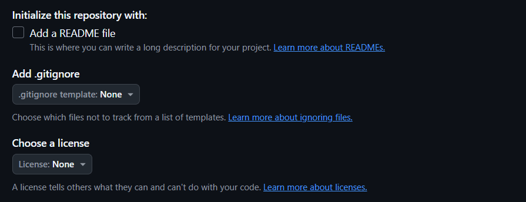

# Git Flow

1. Team Lead creates the remote repository on git hosting service (GitHub, GitLab, Bitbucket, etc.), sets up the project structure, and shares the repository URL with the team.
2. Each team member clones the remote repository to their local machine. (Create a local repo and staging repo)
3. Each team member makes changes to the local repository (Working Area).
4. When the team member completes the changes, they move the changes to the staging area (ready to commit), it's like a checkpoint or add items to the cart. (Staging Area)
5. After reviewing the changes in the staging area, the team member commits the changes, it's like placing an order. (Commit History)

   **Note**: Commit: group of changes on a file or files. (related changes)

6. When completing the day's work, fixes, feature, or version, the team member needs to get the latest version from the remote repository to merge the latest changes with their changes to avoid conflicts. (pull)

7. After merging the latest changes, the team member uploads their changes to the remote repository. (push)

# Create a remote repository on GitHub

1. Open GitHub and log in.
2. Click the `+` icon in the top right corner, and select `New repository`.
   
3. Type a name for your repository, and an optional description.
   
4. Choose a repository visibility (public or private).
   - Public repositories are accessible to everyone on the internet.
   - Private repositories are only accessible to you, people you explicitly share access with, and, for organization repositories, certain organization members.
     
5. You can create a README, which is a document describing your project.

   A README is often the first item a visitor will see when visiting your repository.

6. You can create a .gitignore file, which is a set of ignore rules.

   A .gitignore file specifies which files and directories to ignore from version control.

7. You can choose to add a software license for your project.

   A license specifies how others can use, copy, and distribute your project.

   

8. Click the `Create repository` button.

   

# Set up the project structure

1. Create a new directory on your local machine and navigate to it.
   
2. Create the structure of your project (folders, files, etc.).

   for example: create the main.py file and add the necessary packages.

3. Open the terminal and initialize a new Git repository using `git init`.
4. Add the files to the staging area using `git add .`.
5. Commit the changes using `git commit -m "Initial commit"`.
   
6. Add the remote repository URL using `git remote add origin <URL>`. and check the remote repository using `git remote -v`.
   
7. Push the changes to the remote repository using `git push -u origin master`. `-u` is used to set the upstream branch, so next time you can use `git push` only.
   

# Share the repository URL with the team

1. Click the `Code` button on the GitHub repository page.
2. Copy the repository URL.
   
3. Share the repository URL with the team members.

# Clone the remote repository

1. Once you receive the repository URL, open the terminal and navigate to the directory where you want to clone the repository.
2. Clone the repository using `git clone <URL>`.
   

# Working Area

1. Open the project in your favorite code editor.
2. Make changes to the files as needed.
   
3. Save the changes.

   git will spot the changes and mark them as modified.
   

# Staging Area

1. Once you have made changes to the files, you need to add them to the staging area.
2. Add the files to the staging area using `git add .`.
   

# Commit History

1. After adding the files to the staging area, and review the changes, you can commit the changes.
2. Commit the changes using `git commit -m "Commit message"`.
   

# Pull the latest changes

1. Before pushing your changes to the remote repository, you need to pull the latest changes from the remote repository.
2. Pull the latest changes using `git pull origin main`.

   Local Commit History
   

   Remote Commit History
   

   After Pull
   

# Push the changes to the remote repository

1. After pulling the latest changes, you can push your changes to the remote repository.
2. Push the changes using `git push`.
   
